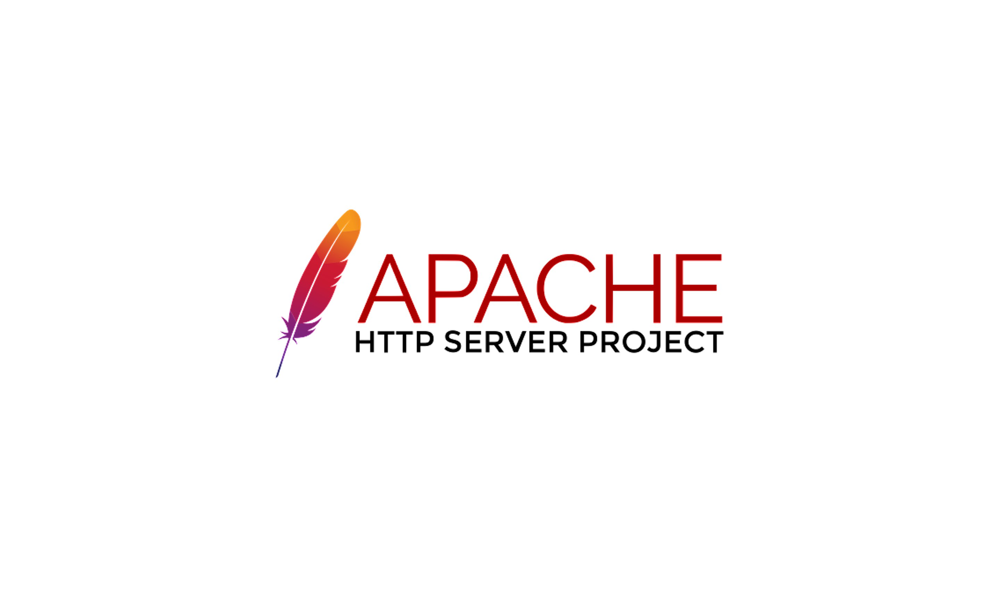

# Analyse technique 

Pour le développement de l'application CNMH, ont va utiliser de différentes technologies, notamment : 

- Apach: est un serveur HTTP créé et maintenu au sein de la fondation Apache.
  Rôle : écouter les requêtes émises par les navigateurs (qui demandent des pages web), chercher la page demandée et la renvoyer.

- PHP: est un langage de script côté serveur.
  Rôle : Gérer la logique métier de l'application, traiter les requêtes et générer des pages dynamiques.

- MySQL :  est une base de données relationnelle.
   Rôle : Stocker et gérer les données de l'application.

- Laravel:  est un framework PHP.
  Rôle : Faciliter le développement en fournissant une structure MVC, des outils de migration de base de données, etc.
  

  - i18n (internationalisation): 
  Gestion de l'internationalisation.
    Rôle : Permettre l'adaptation de l'application à différentes langues et régions.

  - Vite:
   est un build tool rapide pour le développement front-end.
    
   