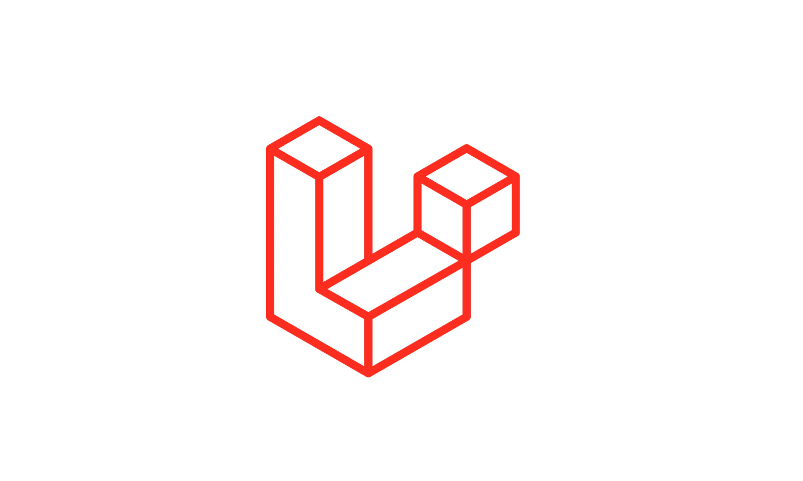

# Analyse technique

## Introduction

## Analyse technique

## APACHE

- Serveur web
- Open Source

## PHP 

- Langage de programmation
- Orienté objet

## LARAVEL 

- Framework
- Architecture MVC
- i18n

## MySQL

- un serveur de bases de données relationnelles

## AdminLTE

- Admin Dashboard
- Responsive Design
- Control Panel Thème

## Repository Pattern

## Références

[Analyse-technique](https://github.com/cnmh/analyse-technique/tree/develop/analyse-technique)

## conclusion
